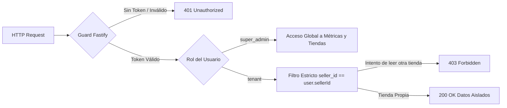
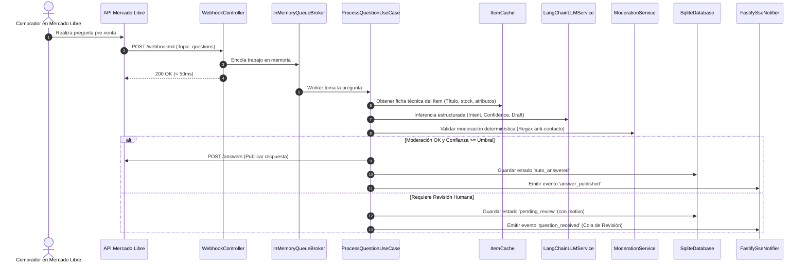

# 🏛️ Arquitectura del Sistema: MELI AI Assistant

Este documento describe la arquitectura técnica de **MELI AI Assistant**, diseñada bajo los principios de **Clean Architecture (Arquitectura Limpia / Hexagonal)**, soporte **Multi-Tenant nativo**, tipado estricto en **TypeScript** y servidor de alto rendimiento con **Fastify**.

---

## 📐 1. Diagrama General de Capas

```mermaid
flowchart TD
    subgraph Frontend [Capa de Presentación Web - Vanilla SPA]
        ADMIN_UI[Dashboard Super Admin - /admin.html]
        ONBOARDING_UI[Wizard Onboarding - /onboarding.html]
        DEMO_UI[Panel Operativo & WhatsApp - /index.html]
    end

    subgraph Presentation [Capa de Presentación Backend - Fastify]
        WC[WebhookController]
        QC[QuestionsController]
        AC[AuthController]
        ADC[AdminController]
        SC[SimulatorController]
        TC[TenantController]
        GUARDS[Guards: authenticate, requireSuperAdmin, optionalAuthenticate]
    end

    subgraph Application [Capa de Aplicación - Casos de Uso]
        IW[IngestWebhookUseCase]
        PQ[ProcessQuestionUseCase]
        AA[ApproveAnswerUseCase]
        RA[RejectAnswerUseCase]
        SQ[SimulateQuestionUseCase]
        RU[RegisterUserUseCase]
        LU[LoginUserUseCase]
        GCU[GetCurrentUserUseCase]
        SS[SeedSuperAdminUseCase]
        CMA[ConnectMeliAccountUseCase]
        GOS[GetOnboardingStatusUseCase]
        GM[GetGlobalMetricsUseCase]
        LT[ListTenantsOverviewUseCase]
        GTD[GetTenantDetailUseCase]
        TT[ToggleTenantAutoAnswerUseCase]
        FR[ForceTokenRefreshUseCase]
    end

    subgraph Domain [Capa de Dominio - Reglas Puras]
        TE[Tenant Entity]
        QE[Question Entity]
        IE[Item Entity]
        UE[User Entity]
        EL[EventLog Entity]
        MS[ModerationService]
        VO[Intent & Moderation Value Objects]
    end

    subgraph Infrastructure [Capa de Infraestructura - Adaptadores]
        MELI[MeliApiClient - OAuth & REST API]
        LLM[LangChainLLMService - Groq/OpenAI/Anthropic]
        QB[InMemoryQueueBroker - Concurrencia 5 workers]
        SSE[FastifySseNotifier - Multi-Tenant SSE Hub]
        SQLITE[SqliteDatabase & Repositorios Relacionales]
        SEC[CryptoPasswordHasher - scrypt & JwtTokenService - HMAC-SHA256]
    end

    Frontend --> Presentation
    Presentation --> Application
    Application --> Domain
    Infrastructure --> Application
    Infrastructure --> Domain
```

---

## 📦 2. Detalle de Componentes por Capa

### 2.1 Capa de Dominio (`src/domain/`)
Contiene las entidades del negocio y reglas independientes de cualquier framework o base de datos:

* **`Tenant`**: Entidad de tienda/cliente de Mercado Libre con credenciales OAuth, configuración (`tone`, `confidenceThreshold`, `autoAnswerEnabled`) y métodos para verificar expiración de tokens (`isTokenExpiringSoon`).
* **`User`**: Entidad de usuario con roles (`super_admin` vs `tenant`), validaciones de formato de email, y control de aislamiento (`canAccessSeller`).
* **`Question`**: Entidad de pregunta pre-venta con máquina de estados (`processing`, `auto_answered`, `pending_review`, `approved`, `rejected`, `error`).
* **`Item`**: Ficha técnica de publicación (título, precio, atributos, condición, stock) con TTL de caché.
* **`EventLog`**: Registro estructurado de eventos para telemetría y auditoría en tiempo real.
* **`ModerationService`**: Motor determinístico de blindaje contra sanciones de Mercado Libre. Detecta números telefónicos en letras/números, enlaces externos, WhatsApp camuflado y solicitudes de cobro por fuera.
* **Value Objects**: `Intent` (clasificación semántica) y `ModerationResult`.

---

### 2.2 Capa de Aplicación (`src/application/`)
Orquesta los flujos de negocio mediante interfaces desacopladas:

#### Puertos / Interfaces (`interfaces/`)
* **Persistencia**: `IUserRepository`, `ITenantRepository`, `IQuestionRepository`, `IItemCacheRepository`, `IEventRepository`.
* **Servicios Externos**: `IMeliClient`, `ILLMService`, `IQueueBroker`, `IRealtimeNotifier`, `IPasswordHasher`, `ITokenService`.

#### Casos de Uso (`use-cases/`)
* **Core & Pipeline**:
  - `IngestWebhookUseCase`: Valida y encola eventos de Mercado Libre en <50ms.
  - `ProcessQuestionUseCase`: Pipeline completo (Caché de Item ➔ Prompt Contextual ➔ Inferencia LLM con Structured Output ➔ Moderación Determinística ➔ Auto-publicación o Cola de Revisión).
  - `ApproveAnswerUseCase`: Publica respuestas aprobadas/editadas por humanos en la API de MELI.
  - `RejectAnswerUseCase`: Descarta preguntas no pertinentes o maliciosas.
  - `SimulateQuestionUseCase`: Permite simulación end-to-end sin llamadas salientes a la API de MELI.
* **Autenticación & Onboarding**:
  - `RegisterUserUseCase` / `LoginUserUseCase` / `GetCurrentUserUseCase`.
  - `SeedSuperAdminUseCase`: Inicializa credenciales maestras si no existen.
  - `ConnectMeliAccountUseCase`: Intercambia el código OAuth de MELI, extrae el `nickname` oficial, crea el Tenant, vincula el `seller_id` al usuario y emite un JWT actualizado.
  - `GetOnboardingStatusUseCase`: Diagnóstico del estado de vinculación y salud del token.
* **Super Administrador**:
  - `GetGlobalMetricsUseCase`: Métricas consolidadas (tasa de auto-respuesta, volumen, latencias, distribución de intenciones).
  - `ListTenantsOverviewUseCase`: Semáforos de salud de credenciales OAuth de toda la plataforma.
  - `GetTenantDetailUseCase`: Ficha técnica profunda con preguntas recientes y logs.
  - `ToggleTenantAutoAnswerUseCase`: Pausa remota de clientes.
  - `ForceTokenRefreshUseCase`: Refresco forzado de tokens OAuth.

---

### 2.3 Capa de Infraestructura (`src/infrastructure/`)
Implementaciones concretas y adaptadores tecnológicos:

* **`SqliteDatabase`**: Base de datos SQLite (`better-sqlite3`) en modo WAL (`Write-Ahead Logging`), migraciones automáticas tolerantes a cambios de esquema e índices por `seller_id` y estado.
* **`MeliApiClient`**: Cliente oficial REST con **Mutex de Concurrencia** por `sellerId` para evitar race-conditions durante la renovación simultánea de tokens OAuth.
* **`LangChainLLMService`**: Integración con LangChain y Structured Output tipado con `zod`, configurable para Groq, OpenAI o Anthropic.
* **`InMemoryQueueBroker`**: Cola en memoria con control de concurrencia (5 workers paralelos) y absorción de picos de tráfico.
* **`FastifySseNotifier`**: Broker de Server-Sent Events con canales aislados por tienda.
* **`CryptoPasswordHasher`**: Hashing criptográfico nativo Node.js con `scrypt` y sal aleatoria.
* **`JwtTokenService`**: Emisión y validación de tokens JWT firmados HMAC-SHA256 con claims tipados.

---

### 2.4 Capa de Presentación (`src/presentation/` & `public/`)
* **Controladores Fastify**: `WebhookController`, `QuestionsController`, `AuthController`, `AdminController`, `SimulatorController`, `TenantController`.
* **Guards de Seguridad**:
  - `authenticate`: Verifica token JWT válido.
  - `requireSuperAdmin`: Restringe acceso exclusivamente a usuarios con rol `super_admin` (**HTTP 403**).
  - `optionalAuthenticate`: Permite acceso de demo interactiva sin token pero respetando el contexto si está presente.
* **Frontend Modular**:
  - `public/admin.html`: Dashboard del Super Admin con métricas, tabla con semáforos de salud y drawer de detalle.
  - `public/onboarding.html`: Asistente de onboarding self-service para nuevos vendedores.
  - `public/index.html`: Vista dividida de demostración operativa y simulador de WhatsApp.

---

## 🔒 3. Seguridad y Aislamiento Multi-Tenant

---

## 📈 4. Ciclo de Vida de una Pregunta Pre-Venta

