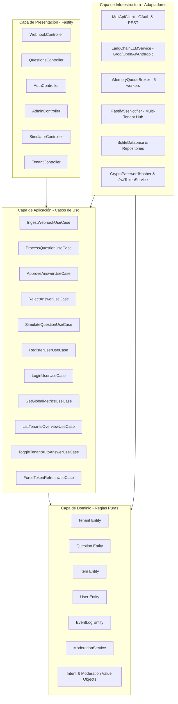

# Arquitectura del Sistema: MELI AI Assistant (Clean Architecture)

Este documento describe la arquitectura de producción del sistema **MELI AI Assistant**, diseñada con los principios de **Clean Architecture (Arquitectura Limpia / Hexagonal)**, soporte **Multi-Tenant nativo** y **TypeScript + Fastify**.

---

## 🏛️ Diagrama General de Capas

---

## 📦 Detalle de Capas

### 1. Capa de Dominio (`src/domain/`)
* **Entidades (`entities/`)**:
  - `Tenant`: Representa a un cliente/vendedor de Mercado Libre con sus credenciales OAuth y configuración personalizada.
  - `User`: Usuario de la plataforma con roles `super_admin` o `tenant`.
  - `Question`: Pregunta pre-venta de Mercado Libre con ciclo de vida y máquina de estados (`processing`, `auto_answered`, `pending_review`, `approved`, `rejected`, `error`).
  - `Item`: Ficha técnica del producto (título, precio, stock, atributos, descripción) con TTL de caché.
  - `EventLog`: Registro de auditoría y telemetría en tiempo real.
* **Servicios de Dominio (`services/`)**:
  - `ModerationService`: Validador determinístico con expresiones regulares anti-sanciones (teléfonos en dígitos o letras, WhatsApp, enlaces, emails, pagos por fuera).

### 2. Capa de Aplicación (`src/application/`)
* **Puertos e Interfaces (`interfaces/`)**:
  - `IUserRepository`, `ITenantRepository`, `IQuestionRepository`, `IItemCacheRepository`, `IEventRepository`.
  - `IMeliClient`, `ILLMService`, `IQueueBroker`, `IRealtimeNotifier`, `IPasswordHasher`, `ITokenService`.
* **Casos de Uso (`use-cases/`)**:
  - Ingesta de webhooks en <50ms.
  - Pipeline de clasificación, moderación y auto-respuesta.
  - Autenticación JWT y control de acceso.
  - Métricas agregadas y administración global.

### 3. Capa de Infraestructura (`src/infrastructure/`)
* **Persistencia**: SQLite con WAL mode, tablas relacionales con índices optimizados.
* **Cliente MELI**: Gestión de tokens OAuth con mutex de refresco por `sellerId`.
* **Servicio LLM**: Integración con LangChain y Structured Outputs (`zod`).
* **Broker de Colas**: Procesamiento concurrente con control de ráfagas y deduplicación.
* **Seguridad**: Criptografía nativa `scrypt` y firmas HMAC-SHA256 para JWT.

### 4. Capa de Presentación (`src/presentation/`)
* Controladores Fastify con guards de autenticación y autorización.
* Aislamiento estricto multi-tenant: los clientes solo pueden consultar y mutar datos de su propio `sellerId`.
