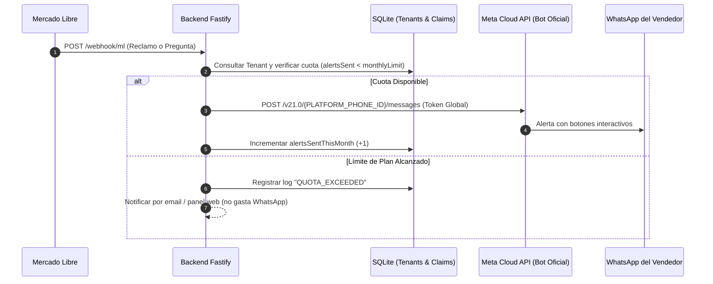
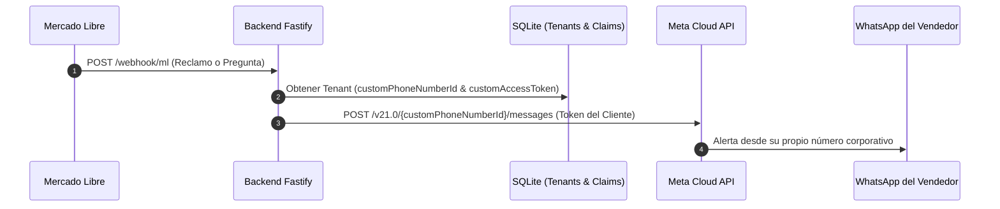

# 🛠️ Planes de Implementación Técnicos: Integración de WhatsApp

Este documento detalla el paso a paso técnico, arquitectura de base de datos, adaptadores y cambios de frontend necesarios para implementar **tanto la Opción A (Bot Centralizado SaaS) como la Opción B (BYO-WABA Descentralizado)**, y cómo ambas convergen en un diseño extensible.

---

## 🏛️ 1. Arquitectura Unificada Extensible (Soporte para Ambas Opciones)

Para no reescribir código cuando queramos soportar una u otra opción, el modelo de datos de `Tenant` se diseña de forma modular:

```typescript
// src/domain/entities/Tenant.ts

export type WhatsAppMode = "platform_shared" | "custom_byo";

export interface WhatsAppSettings {
  mode: WhatsAppMode; // "platform_shared" (Opción A) | "custom_byo" (Opción B)
  alertPhone?: string; // Número del vendedor donde recibe las alertas (ej: "+5491112345678")
  
  // Campos exclusivos para Opción B (BYO-WABA):
  customPhoneNumberId?: string;
  customAccessToken?: string;
  customWabaId?: string;
}

export interface TenantBillingUsage {
  planId: "starter" | "pro" | "enterprise";
  monthlyAlertsLimit: number; // Ej: 150 (Starter), 600 (Pro), 2000 (Enterprise)
  alertsSentThisMonth: number;
  cycleResetDate: string; // Fecha de renovación mensual
}
```

---

## 📋 2. PLAN DE IMPLEMENTACIÓN — OPCIÓN A: Bot Centralizado con Cuotas

> **Objetivo:** Un único número oficial de WhatsApp de la plataforma envía alertas a los números personales/laborales de todos los clientes, con control estricto de consumo mensual por plan.



### Paso A.1: Configuración de Meta de la Plataforma (1 sola vez)
1. Registrar la App en `developers.facebook.com` con producto WhatsApp.
2. Obtener `META_WA_PHONE_NUMBER_ID` y `META_WA_ACCESS_TOKEN` permanente.
3. Registrar la plantilla de utilidad oficial (`claim_alert_v1`) para envíos fuera de la ventana de 24hs.
4. Configurar Webhook receptor en `https://tu-dominio/webhook/whatsapp`.

### Paso A.2: Base de Datos & Metering (Consumo)
1. Modificar tabla `tenants` en `SqliteDatabase.ts`:
   ```sql
   ALTER TABLE tenants ADD COLUMN plan_id TEXT DEFAULT 'starter';
   ALTER TABLE tenants ADD COLUMN monthly_alerts_limit INTEGER DEFAULT 150;
   ALTER TABLE tenants ADD COLUMN alerts_sent_this_month INTEGER DEFAULT 0;
   ALTER TABLE tenants ADD COLUMN cycle_reset_date DATETIME DEFAULT CURRENT_TIMESTAMP;
   ```
2. Crear caso de uso `TrackWhatsAppUsageUseCase.ts`:
   - Verifica si `alerts_sent_this_month < monthly_alerts_limit`.
   - Si está dentro del cupo: autoriza el envío e incrementa el contador.
   - Si excedió: retorna `quota_exceeded: true` y genera alerta en el panel.

### Paso A.3: Adaptador `MetaWhatsAppClient.ts`
- Utiliza las credenciales globales del archivo `.env`.
- Formatea el mensaje interactivo con botones (Aprobar / Rechazar / Ver en MELI).

### Paso A.4: Frontend del Tenant (`public/tenant.html`)
- Pestaña **WhatsApp & Alertas**:
  - Input para ingresar el número de teléfono: `+54911...`.
  - Barra de progreso de consumo de cuota mensual:
    `[████████░░░░░░░░] 65 / 150 alertas utilizadas este mes (Plan Starter)`.
  - Botón de *"Mejorar Plan"* si supera el 80% de uso.

---

## 📋 3. PLAN DE IMPLEMENTACIÓN — OPCIÓN B: BYO-WABA (Cada Cliente Conecta su Meta)

> **Objetivo:** Cada vendedor ingresa sus propias credenciales de Meta for Developers para que los mensajes salgan desde su línea propia y Meta le cobre directamente a su tarjeta.



### Paso B.1: Base de Datos para Credenciales por Tenant
1. Modificar tabla `tenants` en `SqliteDatabase.ts`:
   ```sql
   ALTER TABLE tenants ADD COLUMN wa_mode TEXT DEFAULT 'platform_shared';
   ALTER TABLE tenants ADD COLUMN custom_phone_number_id TEXT;
   ALTER TABLE tenants ADD COLUMN custom_access_token TEXT;
   ALTER TABLE tenants ADD COLUMN custom_waba_id TEXT;
   ```
2. Crear servicio de encriptación simétrica (AES-256-GCM) para almacenar el `custom_access_token` del cliente cifrado en reposo.

### Paso B.2: Adaptador Dinámico `MetaWhatsAppClient.ts`
- Modificar el cliente para recibir opcionalmente credenciales dinámicas:
  ```typescript
  public async sendAlert(dto: SendAlertDTO, tenant: Tenant): Promise<void> {
    const phoneNumberId = tenant.settings.whatsappConfig.customPhoneNumberId || process.env.META_WA_PHONE_NUMBER_ID;
    const token = tenant.settings.whatsappConfig.customAccessToken || process.env.META_WA_ACCESS_TOKEN;

    // Ejecuta fetch contra https://graph.facebook.com/v21.0/${phoneNumberId}/messages con token correspondiente
  }
  ```

### Paso B.3: Frontend del Tenant (`public/tenant.html`)
- Pestaña **WhatsApp & Alertas**:
  - Selector de Modo:
    - `🔘 Usar Bot de la Plataforma (Recomendado)`
    - `🔘 Conectar mi propia cuenta de Meta (Enterprise / Avanzado)`
  - Formulario desplegable para modo BYO:
    - Input: `WhatsApp Business Account ID (WABA ID)`
    - Input: `Phone Number ID`
    - Input: `Token de Acceso Permanente de Meta`
    - Botón de *"Validar y Probar Conexión"*.

### Paso B.4: Guía y Documentación de Onboarding para el Cliente
- Redactar un manual PDF/Web para clientes con el instructivo paso a paso:
  1. Cómo crear cuenta en `business.facebook.com`.
  2. Cómo verificar el número de teléfono con Meta.
  3. Cómo generar un Token de Sistema permanente.

---

## ⏱️ 4. Estimación de Tiempos y Esfuerzo de Desarrollo

| Tarea | Opción A (Centralizado con Cuotas) | Opción B (BYO-WABA Descentralizado) |
|---|---|---|
| **Setup de Meta (Cuentas y App)** | 1 hora (lo hacés vos una sola vez). | N/A (lo hace cada cliente por su cuenta). |
| **Desarrollo Backend** | 3 - 4 horas (control de cuotas + cliente global). | 4 - 5 horas (cifrado de tokens + cliente dinámico). |
| **Desarrollo Frontend** | 2 horas (input de cel + barra de cuota). | 3 horas (formulario avanzado de credenciales Meta). |
| **Testing & Validación** | 2 horas. | 3 horas. |
| **Tiempo Total de Implementación** | **~8 horas de trabajo**. | **~11 horas de trabajo**. |

---

## 💡 5. Recomendación de Estrategia de Lanzamiento

1. **Fase 1 (Inmediata): Implementar la Opción A (Bot Centralizado)**.
   - Permite lanzar el producto al mercado de inmediato y conseguir los primeros clientes sin fricción técnica.
   - Con planes de 150 a 600 alertas mensuales, el margen de ganancia supera el **90%**.
2. **Fase 2 (Siguiente Sprint): Agregar los campos de la Opción B en la base de datos**.
   - Como la arquitectura está preparada, habilitar la Opción B más adelante solo requerirá activar el selector en el frontend cuando un cliente corporativo grande lo solicite.
