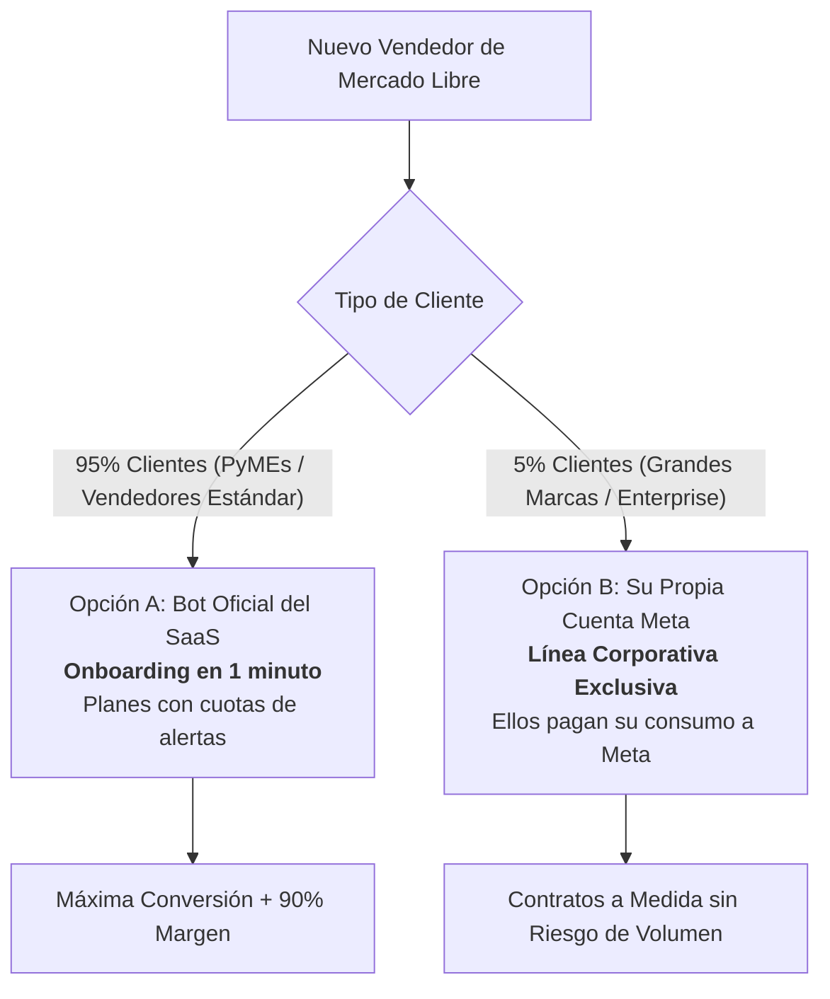

# 📊 Comparativa Estratégica: Modelos de Integración de WhatsApp & Estructura de Costos

**Documento de Decisión y Análisis de Negocio para Socios y Stakeholders**  
*Plataforma: MELI AI Assistant (SaaS de Automatización y Reclamos para Mercado Libre)*

---

## 🎯 1. Resumen Ejecutivo

Con las actualizaciones de precios de **Meta WhatsApp Cloud API (Per-Message Pricing)**, cada mensaje saliente enviado por la empresa tiene un costo unitario (entre **$0.007 y $0.025 USD** según el país y tipo de mensaje).

Para operar nuestro SaaS con clientes reales de Mercado Libre, debemos definir la **arquitectura de entrega de WhatsApp**. Este documento analiza las dos opciones principales y propone la estrategia comercial recomendada.

---

## ⚖️ 2. Comparativa Directa entre Modelos

| Criterio | Opción A: Bot Centralizado de la Plataforma (SaaS) | Opción B: Cada Cliente Conecta su Meta (BYO-WABA) |
|---|---|---|
| **¿Quién crea la cuenta en Meta/Facebook?** | **Nosotros** (1 sola vez para todo el SaaS). | **El Cliente** (cada vendedor debe crear y verificar su cuenta). |
| **Experiencia del Cliente (Onboarding)** | 🟢 **Fricción CERO**: Solo escribe su celular (`+54911...`) en su panel y empieza a recibir alertas. | 🔴 **Fricción ALTA**: Debe validar CUIT, subir estatuto/factura a Facebook, crear app en Meta Developers y generar tokens. |
| **Tiempo para que el cliente empiece a operar** | ⚡ **1 minuto**. | ⏳ **3 a 7 días** (esperando verificación de Meta). |
| **¿Quién paga las facturas de Meta?** | **Nuestra plataforma** (se financia con la suscripción del cliente). | **El Cliente** directo con su tarjeta en Meta. |
| **Riesgo de costo por alto volumen** | Medio (se controla mediante **cuotas por plan**). | Nulo (el cliente absorbe todo el costo de Meta). |
| **Margen de Ganancia del SaaS** | 💰 **90% - 95%** (margen sobre el software + markup). | 💰 **100%** sobre la tarifa fija de software. |
| **Conversión de Venta (Cierre de clientes)** | 🚀 **Muy Alta**: El cliente no hace trámites técnicos. | ⚠️ **Baja**: El 70-80% de las PyMEs abandonan por la burocracia de Meta. |

---

## 🏢 3. Análisis Detallado de las Opciones

---

### 🔹 OPCIÓN A: Bot Centralizado con Planes y Cuotas (Recomendada para Escalar)

#### ¿Cómo funciona?
* Nuestra empresa registra un **único número oficial de WhatsApp** (ej: *"Asistente MeliBot Oficial"*).
* El vendedor de Mercado Libre se registra en nuestra web, conecta su tienda y escribe su celular en su perfil.
* Nuestro backend recibe las preguntas y reclamos de MELI y despacha las alertas al WhatsApp del vendedor correspondiente.
* Solo se envían a WhatsApp los eventos críticos (**Reclamos con SLA** y **Preguntas dudosas/negociación** que requieren intervención humana). El 85% de las preguntas simples se auto-responden en Mercado Libre sin costo de WhatsApp.

#### Estructura de Planes y Rentabilidad (Ejemplo):

| Plan | Límite de Alertas WP / mes | Costo Real Meta para nosotros | Precio de Venta al Cliente | Margen Neto para el SaaS |
|---|---|---|---|---|
| **Starter** | Hasta **150 alertas** | ~$1.50 USD | **$29 USD / mes** | **$27.50 USD (95%)** |
| **Pro** | Hasta **600 alertas** | ~$6.00 USD | **$59 USD / mes** | **$53.00 USD (90%)** |
| **Enterprise** | Hasta **2.000 alertas** | ~$20.00 USD | **$119 USD / mes** | **$99.00 USD (83%)** |

#### Control de Riesgo de Costos:
1. **Contador de uso por cliente:** El sistema registra cuántas alertas consumió cada tienda en el mes (`whatsapp_messages_this_month`).
2. **Límite blando (Soft Limit):** Al llegar al 100% del cupo, el sistema avisa al vendedor: *"Alcanzaste el límite de alertas WhatsApp de tu plan. Pasate a Pro o comprá un pack extra"*. La IA sigue respondiendo en Mercado Libre normalmente, garantizando que nunca tengamos pérdidas.
3. **Packs adicionales:** Paquetes de recarga (ej: *$10 USD por 500 alertas extra*).

---

### 🔹 OPCIÓN B: Descentralizado / BYO-WABA (Bring Your Own WhatsApp)

#### ¿Cómo funciona?
* Nuestra plataforma no envía mensajes con una línea propia.
* En el panel del cliente hay un formulario donde el vendedor debe ingresar:
  - `META_WA_PHONE_NUMBER_ID`
  - `META_WA_ACCESS_TOKEN`
* Cada cliente vincula su propia tarjeta de crédito en Meta y absorbe el costo exacto por mensaje.

#### Ventajas:
* Costo cero de infraestructura de WhatsApp para nuestro SaaS.
* El cliente grande puede usar su propio número corporativo con tilde verde de empresa.

#### Desventajas:
* **Pérdida masiva de clientes en el onboarding:** Una PyME promedio de Mercado Libre no sabe qué es un webhook, un Token de Sistema de Meta ni un WABA.
* Requiere que nuestro equipo dedique horas de soporte técnico para configurar la cuenta de Facebook de cada cliente.

---

## 🌟 4. Propuesta Estratégica: Modelo Híbrido (Lo Mejor de Ambos Mundos)

Para maximizar la cantidad de ventas sin asumir riesgos financieros, la mejor estrategia es el **Modelo Híbrido**:

1. **Para el 95% de los clientes (Self-Service)**:
   - Utilizan el **Bot Oficial Centralizado de la plataforma** con los planes Starter / Pro.
   - Entran, pagan la suscripción, ponen su celular y el sistema funciona al instante.
2. **Para el 5% de Grandes Clientes (Enterprise / Cuentas Corporativas)**:
   - Se les habilita la opción de conectar su propia línea de WhatsApp si así lo requieren por políticas de marca.

---

## 📋 5. Recomendación para la Toma de Decisión

1. **Lanzar comercialmente con la Opción A (Bot Centralizado + Planes por Cuotas)**:
   - Es la única forma de conseguir tracción rápida y validar clientes en menos de 24 horas.
   - Con un margen superior al **90%**, el negocio es sumamente rentable y predecible.
2. **Activar el contador de consumo en el backend**:
   - Para monitorear métricas de cuántos mensajes envía cada tienda y ajustar los precios de los planes según datos reales.
