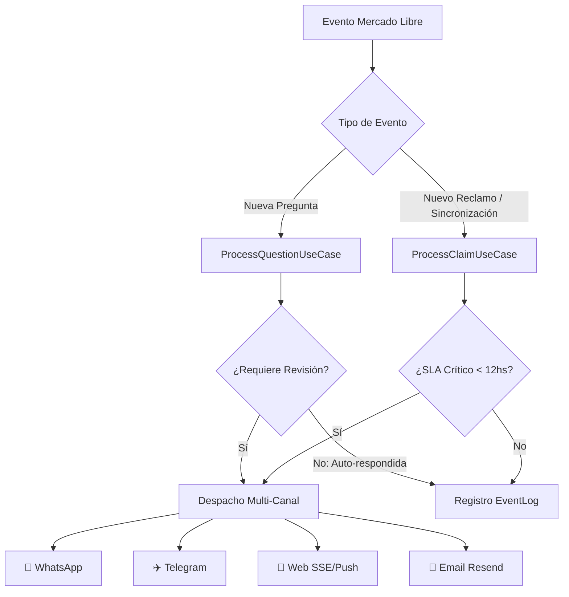

# 📧 Guía Completa de Integración: Resend & Alertas por Email

Guía técnica y operativa paso a paso para configurar **Resend**, implementar el cliente de correo en la arquitectura limpia del proyecto y habilitar notificaciones transaccionales automáticas para **Preguntas que requieren revisión humana** y **Reclamos críticos de Mercado Libre con SLA urgente**.

---

## 📑 Tabla de Contenidos

1. [¿Por qué Resend?](#1-por-qué-resend)
2. [Casos de Uso de Alertas](#2-casos-de-uso-de-alertas)
3. [Configuración Inicial en Resend](#3-configuración-inicial-en-resend)
   - [3.1 Crear Cuenta y API Key](#31-crear-cuenta-y-api-key)
   - [3.2 Modo Sandbox (Desarrollo Rápido)](#32-modo-sandbox-desarrollo-rápido)
   - [3.3 Configuración de Dominio Propio (Producción)](#33-configuración-de-dominio-propio-producción)
4. [Variables de Entorno (`.env`)](#4-variables-de-entorno-env)
5. [Arquitectura e Implementación en el Backend](#5-arquitectura-e-implementación-en-el-backend)
   - [5.1 Instalación del SDK](#51-instalación-del-sdk)
   - [5.2 Interfaz del Contrato (`IEmailClient.ts`)](#52-interfaz-del-contrato-iemailclientts)
   - [5.3 Implementación de Infraestructura (`ResendEmailClient.ts`)](#53-implementación-de-infraestructura-resendemailclientts)
   - [5.4 Actualización de la Entidad Tenant (`Tenant.ts`)](#54-actualización-de-la-entidad-tenant-tenantts)
   - [5.5 Integración en Casos de Uso (`ProcessQuestionUseCase` y `ProcessClaimUseCase`)](#55-integración-en-casos-de-uso)
6. [Diseño y Templates HTML de los Emails](#6-diseño-y-templates-html-de-los-emails)
7. [Endpoints de Diagnóstico y Configuración](#7-endpoints-de-diagnóstico-y-configuración)
8. [Configuración en el Portal del Tenant (UI)](#8-configuración-en-el-portal-del-tenant-ui)
9. [Scripts de Prueba y Verificación](#9-scripts-de-prueba-y-verificación)
10. [Troubleshooting & Preguntas Frecuentes](#10-troubleshooting--preguntas-frecuentes)

---

## 1. ¿Por qué Resend?

[Resend](https://resend.com) es una plataforma moderna para envío de emails transaccionales diseñada específicamente para desarrolladores:

* ⚡ **Latencia Ultra-Baja**: Envío instantáneo mediante APIs HTTP REST optimizadas.
* 📦 **SDK Oficial para Node.js / TypeScript**: Soporte nativo con tipado completo.
* 🧪 **Modo Sandbox Inmediato**: Permite realizar pruebas desde `onboarding@resend.dev` hacia tu email registrado sin necesidad de configurar DNS previamente.
* 📊 **Dashboard y Métricas en Tiempo Real**: Tracking de entregados, abiertos, clicks y rebotes.
* 🛡️ **Excelente Entregabilidad**: Soporte nativo y validación guiada de SPF, DKIM y DMARC.

---

## 2. Casos de Uso de Alertas

En **MELI AI Assistant**, el canal de Email complementa a WhatsApp, Telegram y las notificaciones Web en tiempo real:



### 🚨 1. Pregunta Requiere Revisión Humana
* **Disparador:** La IA detectó baja confianza (`confidence < threshold`), moderación bloqueada, falta de stock/información técnica específica o el tenant configuró modo manual.
* **Contenido:**
  - Título y precio del ítem publicado.
  - Pregunta exacta del comprador.
  - Respuesta sugerida generada por la IA.
  - Motivo de la derivación humana.
  - Botón de acceso directo para responder con un clic desde el portal.

### ⏰ 2. Reclamo con SLA Crítico (< 12 Horas)
* **Disparador:** Reclamo abierto en Mercado Libre cuyo tiempo restante para responder antes de afectar reputación es inferior a 12 horas.
* **Contenido:**
  - Número de reclamo y orden asociada.
  - Comprador y motivo del reclamo.
  - Contador de horas restantes con badge de urgencia.
  - Acciones sugeridas (mediación, reembolso, mensaje).

### 🧪 3. Verificación y Prueba de Conectividad
* **Disparador:** El vendedor hace clic en "Enviar Correo de Prueba" desde el Portal de Configuración de Canales (`/channels`).

---

## 3. Configuración Inicial en Resend

### 3.1 Crear Cuenta y API Key

1. Ingresá a [https://resend.com](https://resend.com) y creá una cuenta con tu correo electrónico o GitHub.
2. Dirigite a la sección **API Keys** en el panel izquierdo.
3. Hacé clic en **Create API Key**:
   - **Name:** `meli-ai-assistant-dev` (o `meli-ai-assistant-prod`)
   - **Permission:** `Full Access` (o `Sending access`)
   - **Domain:** `All domains`
4. Copiá la clave generada (empieza con `re_...`). **Guardala en un lugar seguro ya que sólo se muestra una vez.**

---

### 3.2 Modo Sandbox (Desarrollo Rápido)

Para comenzar a desarrollar **sin configurar dominios ni DNS**:
* **Remitente permitido:** `onboarding@resend.dev`
* **Destinatario permitido:** Exclusivamente el correo con el que te registraste en Resend.
* **Ejemplo en `.env`:**
  ```env
  RESEND_API_KEY=re_tu_api_key_aqui
  EMAIL_FROM=MELI AI Assistant <onboarding@resend.dev>
  ```

---

### 3.3 Configuración de Dominio Propio (Producción)

Para enviar correos a cualquier dirección (como los emails de los vendedores):

1. En el panel de Resend, ingresá a **Domains** > **Add Domain**.
2. Ingresá tu dominio (ej: `tudominio.com` o subdominio `mail.tudominio.com`).
3. Agregá los registros DNS en tu proveedor de DNS (Cloudflare, GoDaddy, Namecheap, etc.):
   - **DKIM (CNAME / TXT)**: Firma criptográfica para autenticar el remitente.
   - **SPF (TXT)**: Autorización de servidores de envío.
   - **DMARC (TXT)**: Política de protección contra spoofing.
4. Una vez verificado (generalmente toma entre 2 y 10 minutos), actualizá tu `.env`:
   ```env
   EMAIL_FROM=MELI AI Assistant <alertas@tudominio.com>
   ```

---

## 4. Variables de Entorno (`.env`)

Agregá las siguientes variables a tu archivo `.env` en la raíz del proyecto:

```ini
# ==========================================
# CONFIGURACIÓN DE RESEND (EMAIL ALERTS)
# ==========================================
# API Key de Resend (obtenida de https://resend.com/api-keys)
RESEND_API_KEY=re_123456789_abcdefg...

# Remitente de los correos
# Para pruebas: "MELI AI Assistant <onboarding@resend.dev>"
# Para producción: "MELI AI Assistant <alertas@tudominio.com>"
EMAIL_FROM=MELI AI Assistant <onboarding@resend.dev>

# Habilitación global del servicio de email (true | false)
EMAIL_ENABLED=true
```

---

## 5. Arquitectura e Implementación en el Backend

Seguimos los principios de **Clean Architecture**:
* **Domain**: Define tipos de configuración de alertas en `TenantSettings`.
* **Application**: Define el contrato `IEmailClient` y consume el servicio en los casos de uso.
* **Infrastructure**: Implementa `ResendEmailClient` usando el SDK de Resend.

```
src/
├── application/
│   ├── interfaces/
│   │   └── IEmailClient.ts          <-- Contrato
│   └── use-cases/
│       ├── ProcessQuestionUseCase.ts <-- Envío de alerta de pregunta
│       └── ProcessClaimUseCase.ts    <-- Envío de alerta de reclamo
├── domain/
│   └── entities/
│       └── Tenant.ts                <-- Preferencias de email por tenant
├── infrastructure/
│   └── email/
│       └── ResendEmailClient.ts      <-- Implementación con SDK Resend
└── presentation/
    └── controllers/
        └── TenantController.ts      <-- Test email y configuración
```

---

### 5.1 Instalación del SDK

Instalá el paquete oficial de Resend en el backend:

```powershell
npm install resend
```

---

### 5.2 Interfaz del Contrato (`IEmailClient.ts`)

Archivo: `src/application/interfaces/IEmailClient.ts`

```typescript
export interface SendQuestionAlertParams {
  to: string;
  sellerId: string;
  questionId: string;
  itemTitle: string;
  itemPrice?: number;
  questionText: string;
  suggestedAnswer?: string;
  reason: string;
  portalUrl?: string;
}

export interface SendClaimAlertParams {
  to: string;
  sellerId: string;
  claimId: string;
  orderId?: string;
  reason: string;
  remainingHours: number;
  urgency: 'low' | 'medium' | 'high' | 'critical';
  portalUrl?: string;
}

export interface SendTestEmailParams {
  to: string;
  tenantName?: string;
}

export interface EmailSendResult {
  success: boolean;
  messageId?: string;
  error?: string;
}

export interface IEmailClient {
  sendQuestionReviewAlert(params: SendQuestionAlertParams): Promise<EmailSendResult>;
  sendClaimSlaAlert(params: SendClaimAlertParams): Promise<EmailSendResult>;
  sendTestEmail(params: SendTestEmailParams): Promise<EmailSendResult>;
}
```

---

### 5.3 Implementación de Infraestructura (`ResendEmailClient.ts`)

Archivo: `src/infrastructure/email/ResendEmailClient.ts`

```typescript
import { Resend } from 'resend';
import {
  IEmailClient,
  SendQuestionAlertParams,
  SendClaimAlertParams,
  SendTestEmailParams,
  EmailSendResult,
} from '../../application/interfaces/IEmailClient.js';

export class ResendEmailClient implements IEmailClient {
  private resend: Resend | null = null;
  private fromEmail: string;

  constructor(apiKey?: string, fromEmail?: string) {
    const key = apiKey || process.env.RESEND_API_KEY;
    this.fromEmail = fromEmail || process.env.EMAIL_FROM || 'MELI AI Assistant <onboarding@resend.dev>';

    if (key) {
      this.resend = new Resend(key);
    } else {
      console.warn('⚠️ [ResendEmailClient] RESEND_API_KEY no configurada. Los emails se registrarán en log simulado.');
    }
  }

  public async sendQuestionReviewAlert(params: SendQuestionAlertParams): Promise<EmailSendResult> {
    const html = this.buildQuestionAlertHtml(params);
    const subject = `🤔 [Revisión Requerida] Nueva pregunta en "${params.itemTitle.slice(0, 40)}..."`;

    return this.sendMail(params.to, subject, html);
  }

  public async sendClaimSlaAlert(params: SendClaimAlertParams): Promise<EmailSendResult> {
    const html = this.buildClaimAlertHtml(params);
    const urgencyEmoji = params.urgency === 'critical' ? '🚨 URGENTE' : '⏰ ATENCIÓN';
    const subject = `${urgencyEmoji}: Reclamo #${params.claimId} vence en ${params.remainingHours}h`;

    return this.sendMail(params.to, subject, html);
  }

  public async sendTestEmail(params: SendTestEmailParams): Promise<EmailSendResult> {
    const html = `
      <div style="font-family: -apple-system, BlinkMacSystemFont, 'Segoe UI', Roboto, sans-serif; max-width: 600px; margin: 0 auto; padding: 24px; background: #0f172a; color: #f8fafc; border-radius: 12px; border: 1px solid #334155;">
        <h2 style="color: #60a5fa; margin-top: 0;">🎉 ¡Conexión con Resend Exitosa!</h2>
        <p>Hola <strong>${params.tenantName || 'Vendedor'}</strong>,</p>
        <p>Tu canal de alertas por correo electrónico está correctamente vinculado con <strong>MELI AI Assistant</strong>.</p>
        <div style="background: #1e293b; padding: 16px; border-radius: 8px; border-left: 4px solid #10b981; margin: 20px 0;">
          <p style="margin: 0; font-size: 14px; color: #cbd5e1;">A partir de ahora recibirás aquí las preguntas que requieran moderación o respuesta personalizada, y avisos de reclamos urgentes.</p>
        </div>
        <p style="font-size: 12px; color: #64748b; margin-bottom: 0;">Enviado automáticamente por MELI AI Assistant con tecnología Resend.</p>
      </div>
    `;
    const subject = '✅ Verificación de Alertas por Email - MELI AI Assistant';

    return this.sendMail(params.to, subject, html);
  }

  private async sendMail(to: string, subject: string, html: string): Promise<EmailSendResult> {
    if (!this.resend) {
      console.log(`📧 [Simulación Email] Para: ${to} | Asunto: ${subject}`);
      return { success: true, messageId: 'simulated_no_api_key' };
    }

    try {
      const response = await this.resend.emails.send({
        from: this.fromEmail,
        to: [to],
        subject,
        html,
      });

      if (response.error) {
        console.error('❌ [Resend] Error al enviar email:', response.error);
        return { success: false, error: response.error.message };
      }

      return { success: true, messageId: response.data?.id };
    } catch (err: any) {
      console.error('❌ [Resend] Excepción al enviar correo:', err);
      return { success: false, error: err.message || 'Unknown error' };
    }
  }

  private buildQuestionAlertHtml(params: SendQuestionAlertParams): string {
    const portalUrl = params.portalUrl || 'http://localhost:5173/questions';
    return `
      <div style="font-family: -apple-system, BlinkMacSystemFont, 'Segoe UI', Roboto, sans-serif; max-width: 600px; margin: 0 auto; padding: 24px; background: #0f172a; color: #f8fafc; border-radius: 12px; border: 1px solid #334155;">
        <div style="display: flex; align-items: center; justify-content: space-between; margin-bottom: 16px;">
          <span style="background: #eab308; color: #000; font-size: 12px; font-weight: bold; padding: 4px 10px; border-radius: 20px; text-transform: uppercase;">
            Revisión Requerida
          </span>
          <span style="color: #94a3b8; font-size: 13px;">MELI AI Assistant</span>
        </div>
        
        <h2 style="color: #f8fafc; margin-top: 0; font-size: 18px;">
          ${params.itemTitle}
        </h2>
        
        <div style="background: #1e293b; padding: 16px; border-radius: 8px; margin: 16px 0; border: 1px solid #334155;">
          <p style="margin: 0 0 6px 0; font-size: 12px; color: #94a3b8; text-transform: uppercase; font-weight: 600;">Pregunta del comprador:</p>
          <p style="margin: 0; font-size: 15px; color: #f1f5f9; font-style: italic;">"${params.questionText}"</p>
        </div>

        ${params.suggestedAnswer ? `
        <div style="background: #022c22; padding: 16px; border-radius: 8px; margin: 16px 0; border: 1px solid #059669;">
          <p style="margin: 0 0 6px 0; font-size: 12px; color: #34d399; text-transform: uppercase; font-weight: 600;">💡 Sugerencia generada por IA:</p>
          <p style="margin: 0; font-size: 14px; color: #a7f3d0;">"${params.suggestedAnswer}"</p>
        </div>
        ` : ''}

        <p style="font-size: 13px; color: #cbd5e1; margin: 12px 0;">
          <strong>Motivo:</strong> ${params.reason}
        </p>

        <div style="margin-top: 24px; text-align: center;">
          <a href="${portalUrl}" style="display: inline-block; background: #3b82f6; color: #ffffff; text-decoration: none; padding: 12px 28px; border-radius: 8px; font-weight: 600; font-size: 14px;">
            Aprobar o Responder en el Portal
          </a>
        </div>
      </div>
    `;
  }

  private buildClaimAlertHtml(params: SendClaimAlertParams): string {
    const portalUrl = params.portalUrl || 'http://localhost:5173/claims';
    const isCritical = params.urgency === 'critical';
    const badgeBg = isCritical ? '#ef4444' : '#f97316';

    return `
      <div style="font-family: -apple-system, BlinkMacSystemFont, 'Segoe UI', Roboto, sans-serif; max-width: 600px; margin: 0 auto; padding: 24px; background: #0f172a; color: #f8fafc; border-radius: 12px; border: 1px solid #334155;">
        <div style="margin-bottom: 16px;">
          <span style="background: ${badgeBg}; color: #ffffff; font-size: 12px; font-weight: bold; padding: 4px 10px; border-radius: 20px; text-transform: uppercase;">
            ${isCritical ? '🚨 SLA Crítico' : '⏰ Alerta de Reclamo'}
          </span>
        </div>
        
        <h2 style="color: #f8fafc; margin-top: 0; font-size: 18px;">
          Reclamo #${params.claimId} ${params.orderId ? `(Orden #${params.orderId})` : ''}
        </h2>

        <div style="background: #1e293b; padding: 16px; border-radius: 8px; margin: 16px 0; border: 1px solid #334155;">
          <p style="margin: 0 0 6px 0; font-size: 12px; color: #94a3b8; text-transform: uppercase; font-weight: 600;">Motivo del comprador:</p>
          <p style="margin: 0; font-size: 15px; color: #f1f5f9;">${params.reason}</p>
        </div>

        <div style="background: ${isCritical ? '#450a0a' : '#431407'}; padding: 14px 16px; border-radius: 8px; margin: 16px 0; border: 1px solid ${isCritical ? '#b91c1c' : '#c2410c'};">
          <p style="margin: 0; font-size: 14px; font-weight: 600; color: ${isCritical ? '#fca5a5' : '#fed7aa'};">
            ⏳ Tiempo restante para responder: ${params.remainingHours} horas
          </p>
        </div>

        <div style="margin-top: 24px; text-align: center;">
          <a href="${portalUrl}" style="display: inline-block; background: ${badgeBg}; color: #ffffff; text-decoration: none; padding: 12px 28px; border-radius: 8px; font-weight: 600; font-size: 14px;">
            Gestionar Reclamo Ahora
          </a>
        </div>
      </div>
    `;
  }
}
```

---

### 5.4 Actualización de la Entidad Tenant (`Tenant.ts`)

En `src/domain/entities/Tenant.ts`:

```typescript
export interface TenantSettings {
  // ... otras configuraciones existentes ...

  // Configuración de Email Alerts
  emailAlertAddress?: string;
  emailAlertsEnabled?: boolean;
  emailAlertTypes?: 'questions_only' | 'claims_only' | 'all';

  // Multi-canal preferido
  preferredAlertChannel?: 'whatsapp' | 'telegram' | 'email' | 'both' | 'all';
}
```

Métodos de conveniencia en la clase `Tenant`:
```typescript
public canSendEmailAlert(): boolean {
  if (!this.settings.emailAlertsEnabled && this.settings.preferredAlertChannel !== 'email' && this.settings.preferredAlertChannel !== 'all') {
    return false;
  }
  return Boolean(this.settings.emailAlertAddress || this.email);
}

public getEmailAlertAddress(): string | undefined {
  return this.settings.emailAlertAddress || this.email;
}
```

---

### 5.5 Integración en Casos de Uso

#### En `ProcessQuestionUseCase.ts`:

```typescript
// Si requiere revisión y el tenant tiene habilitado el email
if (tenantAlert && tenantAlert.canSendEmailAlert()) {
  const targetEmail = tenantAlert.getEmailAlertAddress();
  if (targetEmail && this.emailClient) {
    await this.emailClient.sendQuestionReviewAlert({
      to: targetEmail,
      sellerId,
      questionId,
      itemTitle: item.title,
      itemPrice: item.price,
      questionText: question.text,
      suggestedAnswer: classification.answer,
      reason: reviewReason,
    }).catch(err => console.error('[ProcessQuestionUseCase] Error enviando email:', err));
  }
}
```

---

## 6. Diseño y Templates HTML de los Emails

Los emails están diseñados con un enfoque **Dark Mode Moderno & Responsive**, optimizado con CSS inline compatible con todos los clientes de correo (Gmail, Outlook, Apple Mail, Thunderbird, etc.).

### Vista Previa: Alerta de Pregunta

```
┌─────────────────────────────────────────────────────────────┐
│ 🟨 REVISIÓN REQUERIDA                  MELI AI Assistant   │
│                                                             │
│ Auriculares Sony WH-1000XM5 Noise Cancelling                │
│                                                             │
│ ┌─ PREGUNTA DEL COMPRADOR ────────────────────────────────┐ │
│ │ "¿Viene con cable de audio 3.5mm o sólo bluetooth?"    │ │
│ └─────────────────────────────────────────────────────────┘ │
│                                                             │
│ ┌─ 💡 SUGERENCIA GENERADA POR IA ─────────────────────────┐ │
│ │ "¡Hola! Sí, incluye el cable de audio de 3.5mm..."      │ │
│ └─────────────────────────────────────────────────────────┘ │
│                                                             │
│ Motivo: Requiere confirmación de accesorios en caja         │
│                                                             │
│            [  Aprobar o Responder en el Portal  ]           │
└─────────────────────────────────────────────────────────────┘
```

---

## 7. Endpoints de Diagnóstico y Configuración

Podés agregar el endpoint para probar el envío desde el frontend:

* **`POST /api/tenant/channels/email/test`**
  - **Headers**: `Authorization: Bearer <jwt_token>`
  - **Body**:
    ```json
    {
      "email": "vendedor@ejemplo.com"
    }
    ```
  - **Respuesta 200 OK**:
    ```json
    {
      "success": true,
      "message": "Email de prueba enviado exitosamente a vendedor@ejemplo.com",
      "messageId": "4f9d2a01-..."
    }
    ```

---

## 8. Configuración en el Portal del Tenant (UI)

En el panel de configuración de canales (`client/src/pages/TenantPage.tsx`), se añade la tarjeta de Email junto a WhatsApp y Telegram:

* **Switch de Habilitación**: Activar/desactivar alertas por correo.
* **Input de Correo**: Dirección de email a la que deben llegar las notificaciones (por defecto toma el email del usuario logueado).
* **Selector de Alcance**:
  - `Todas las alertas` (Preguntas + Reclamos)
  - `Sólo preguntas que requieren revisión`
  - `Sólo reclamos con SLA urgente`
* **Botón "Enviar Correo de Prueba"**: Valida la entrega en 2 segundos.

---

## 9. Scripts de Prueba y Verificación

Podés crear un script rápido en `scripts/test-resend.ts` para verificar la API Key directamente:

```typescript
import { Resend } from 'resend';
import dotenv from 'dotenv';
dotenv.config();

const resend = new Resend(process.env.RESEND_API_KEY);

async function test() {
  console.log('🚀 Probando conexión con Resend...');
  const { data, error } = await resend.emails.send({
    from: process.env.EMAIL_FROM || 'onboarding@resend.dev',
    to: ['tu-email-registrado@resend.com'],
    subject: '🧪 Test de Conexión MELI AI Assistant',
    html: '<h1>¡Funciona correctamente!</h1><p>Prueba enviada desde Resend SDK.</p>',
  });

  if (error) {
    console.error('❌ Error:', error);
  } else {
    console.log('✅ Email enviado con ID:', data?.id);
  }
}

test();
```

Para ejecutarlo:
```powershell
npx tsx scripts/test-resend.ts
```

---

## 10. Troubleshooting & Preguntas Frecuentes

### ❓ Error 403: "You can only send testing emails to your own email address"
* **Causa**: Estás usando el remitente sandbox `onboarding@resend.dev` y enviaste a un correo distinto al que creaste la cuenta en Resend.
* **Solución**: En desarrollo, enviá únicamente a tu propio correo. Para enviar a clientes o vendedores reales, verificá tu dominio en Resend (**Domains** > **Add Domain**).

### ❓ El email cae en la carpeta de Spam / No Deseado
* **Solución**: Asegurate de configurar los 3 registros DNS en tu dominio:
  1. **SPF**: `v=spf1 include:amazonses.com ~all`
  2. **DKIM**: Clave CNAME provista por Resend.
  3. **DMARC**: `v=DMARC1; p=none; rua=mailto:dmarc@tudominio.com`

### ❓ ¿Qué pasa si no tengo `RESEND_API_KEY` configurada?
* El sistema no fallará ni lanzará excepciones no controladas. El `ResendEmailClient` detectará la falta de clave y registrará la simulación del envío en consola (`console.log`), permitiendo que el resto del flujo de preguntas y reclamos continúe sin interrupciones.
