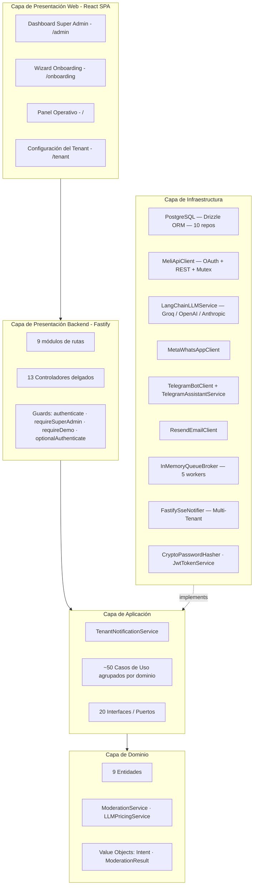
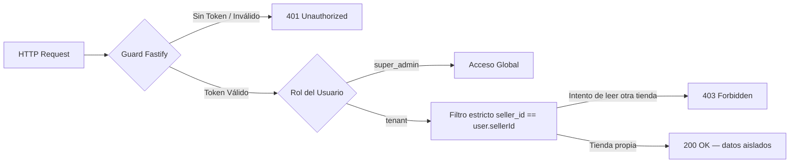
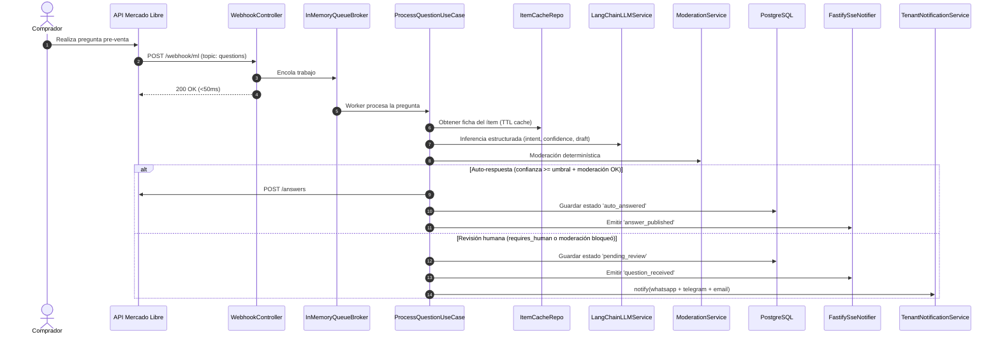
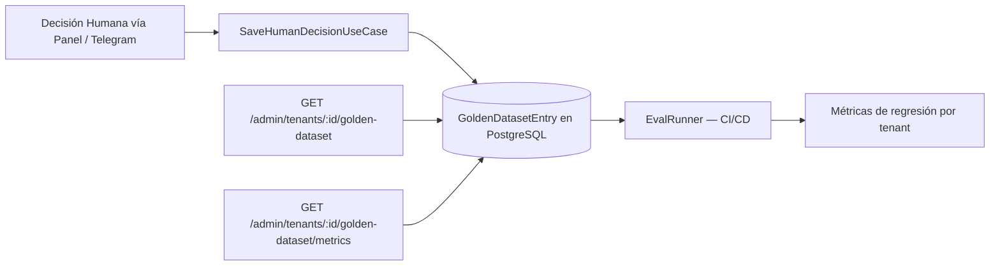

# 🏛️ Arquitectura del Sistema: MELI AI Assistant

**MELI AI Assistant** sigue los principios de **Clean Architecture** (Hexagonal / Capas), con soporte **Multi-Tenant nativo**, TypeScript estricto, y servidor **Fastify**. La base de datos es **PostgreSQL** con Drizzle ORM.

---

## 📐 1. Diagrama General de Capas



---

## 📦 2. Capa de Dominio (`src/domain/`)

Reglas de negocio y entidades independientes de frameworks o bases de datos.

### Entidades

| Entidad | Descripción |
|---|---|
| `Tenant` | Tienda/cliente ML con credenciales OAuth, settings (tono, umbral, canales de alerta), permisos granulares y cuotas WhatsApp. |
| `User` | Usuario con roles (`super_admin` / `tenant`), password hash, token de reset y control de acceso por `sellerId`. |
| `Question` | Pregunta pre-venta con máquina de estados: `processing` → `auto_answered` / `pending_review` → `approved` / `rejected` / `error`. |
| `Claim` | Reclamo post-venta con tipo, etapa SLA, urgencia, `dueDate` calculado y estado de notificación (`markNotified`). |
| `OrderMessage` | Mensaje post-venta (pack) con respuesta sugerida por LLM y estado de envío. |
| `Item` | Ficha técnica de publicación: título, precio, atributos, condición, stock, TTL de caché. |
| `ItemKnowledge` | Reglas de conocimiento personalizadas por producto (FAQ, instrucciones especiales). |
| `EventLog` | Registro estructurado de eventos para auditoría y telemetría en tiempo real. |
| `GoldenDatasetEntry` | Decisión humana almacenada: `questionId`, `humanDecision` (approve/reject), `qualityRating` e `intent` anotado, usada para evaluación de modelos. |

### Servicios de Dominio

- **`ModerationService`**: Motor determinístico contra sanciones ML. Detecta teléfonos en letras/números, links externos, WhatsApp camuflado, cobros fuera de plataforma.
- **`LLMPricingService`**: Calcula costos por modelo/proveedor para el registro de uso.

---

## 📦 3. Capa de Aplicación (`src/application/`)

### Puertos / Interfaces (`interfaces/`)

20 interfaces que desacoplan la aplicación de infraestructura:

**Persistencia:** `IUserRepository`, `ITenantRepository`, `IQuestionRepository`, `IItemCacheRepository`, `IEventRepository`, `IClaimRepository`, `IOrderMessageRepository`, `IItemKnowledgeRepository`, `ILLMUsageRepository`, `IGoldenDatasetRepository`

**Servicios externos:** `IMeliClient`, `ILLMService`, `IQueueBroker`, `IRealtimeNotifier`, `IPasswordHasher`, `ITokenService`, `IWhatsAppClient`, `ITelegramClient`, `ITelegramAssistantService`, `IEmailClient`

### Servicio de Aplicación

**`TenantNotificationService`** (`services/`): Centraliza la mecánica de alertas multi-canal (WhatsApp → Telegram → Email) para cualquier use case que necesite notificar a un tenant. Cada canal tiene su propio gate de habilitación, cuota y log de evento. Los errores de envío son no-fatales (`.catch`).

### Casos de Uso (`use-cases/`)

#### Preguntas (`questions/`)
| Use Case | Responsabilidad |
|---|---|
| `IngestWebhookUseCase` | Valida y encola eventos ML en <50ms |
| `ProcessQuestionUseCase` | Pipeline completo: caché de ítem → LLM → moderación → auto-publicación o revisión humana + notificación |
| `ApproveAnswerUseCase` | Publica respuesta aprobada/editada en API ML + SSE |
| `RejectAnswerUseCase` | Descarta pregunta + SSE |
| `SaveHumanDecisionUseCase` | Guarda decisión humana en golden dataset y delega a approve/reject |
| `SimulateQuestionUseCase` | Pipeline completo sin llamadas reales a ML |
| `ListQuestionsUseCase` | Listado paginado con enriquecimiento de ítem y metadata |

#### Reclamos (`claims/`)
| Use Case | Responsabilidad |
|---|---|
| `IngestClaimWebhookUseCase` | Parsea webhook ML y procesa el reclamo |
| `ProcessClaimUseCase` | Calcula urgencia/SLA, guarda el reclamo, envía alerta multi-canal vía `TenantNotificationService` |
| `ListClaimsUseCase` | Listado paginado con enriquecimiento desde ML API |
| `SimulateClaimUseCase` | Inyecta reclamo demo con alertas a todos los canales habilitados |
| `SetClaimStatusUseCase` | Transiciones de estado: ack, unack, close, reopen |

#### Mensajería Post-Venta (`order-messages/`)
| Use Case | Responsabilidad |
|---|---|
| `IngestOrderMessageWebhookUseCase` | Parsea y procesa mensajes de packs/órdenes |
| `ProcessOrderMessageUseCase` | Clasifica con LLM, genera respuesta sugerida, notifica vía Telegram |
| `ReplyOrderMessageUseCase` | Envía respuesta a ML API |
| `ListOrderMessagesUseCase` | Listado paginado |

#### Canales (`channels/`)
| Use Case | Responsabilidad |
|---|---|
| `HandleWhatsAppReplyUseCase` | Parsea botones interactivos y texto libre del vendedor, delega a approve/reject |
| `HandleTelegramWebhookUseCase` | **Fachada**: enruta `message` → `TelegramMessageHandler`, `callback_query` → `TelegramCallbackQueryHandler` |

Subdirectorio `channels/telegram/`:
- `TelegramMessageHandler`: Maneja `/start tenant_<sellerId>` (vinculación) y mensajes de texto (asistente LangChain).
- `TelegramCallbackQueryHandler`: Botones inline — aprobar/rechazar preguntas, aprobar respuestas post-venta, acuse de reclamos, detalle de reclamo vía asistente.

#### Autenticación (`auth/`)
`RegisterUserUseCase`, `LoginUserUseCase`, `GetCurrentUserUseCase`, `SeedSuperAdminUseCase`, `SeedDemoUserUseCase`, `ConnectMeliAccountUseCase`, `GetOnboardingStatusUseCase`, `RequestPasswordResetUseCase`, `ResetPasswordUseCase`, `ActivateTenantUseCase`

#### Administración (`admin/`)
`GetGlobalMetricsUseCase`, `ListTenantsOverviewUseCase`, `GetTenantDetailUseCase`, `ToggleTenantAutoAnswerUseCase`, `ForceTokenRefreshUseCase`, `UpdateTenantPermissionsUseCase`, `UpdateTenantIntegrationsUseCase`, `CreateTenantUseCase`, `GetLLMUsageStatsUseCase`

#### Tenant (`tenant/`)
`GetTenantSettingsUseCase`, `UpdateTenantSettingsUseCase`, `SendTestEmailUseCase`, `ListTeamMembersUseCase`, `InviteTeamMemberUseCase`, `RemoveTeamMemberUseCase`, `GetTenantLLMUsageUseCase`, `SetLLMSpendingLimitUseCase`

#### Productos (`products/`)
`GetSellerProductsUseCase`, `SaveItemKnowledgeUseCase`, `SuggestItemFaqsUseCase`

#### Demo (`demo/`)
`SeedDemoDataUseCase`: Inyecta preguntas y reclamos simulados con presets realistas.

---

## 📦 4. Capa de Infraestructura (`src/infrastructure/`)

### Persistencia (`persistence/drizzle/` + `persistence/postgres/`)

Base de datos **PostgreSQL** con **Drizzle ORM**. 10 repositorios:

| Repositorio | Entidad |
|---|---|
| `PostgresTenantRepository` | `Tenant` |
| `PostgresQuestionRepository` | `Question` |
| `PostgresItemCacheRepository` | `Item` |
| `PostgresEventRepository` | `EventLog` |
| `PostgresUserRepository` | `User` |
| `PostgresClaimRepository` | `Claim` |
| `PostgresItemKnowledgeRepository` | `ItemKnowledge` |
| `PostgresOrderMessageRepository` | `OrderMessage` |
| `PostgresLLMUsageRepository` | Registros de uso LLM por tenant |
| `PostgresGoldenDatasetRepository` | `GoldenDatasetEntry` |

### Adaptadores

| Adaptador | Descripción |
|---|---|
| `MeliApiClient` | Cliente REST ML con **Mutex por `sellerId`** contra race conditions en refresh de OAuth |
| `QuestionsPoller` | Polling activo de preguntas ML (job de background) |
| `LangChainLLMService` | Integración LangChain con Structured Output (zod). Proveedores: Groq / OpenAI / Anthropic. Registra tokens y costo por llamada en `LLMUsageRepository`. Dispara alerta Telegram al alcanzar spending limit. |
| `TelegramAssistantService` | Asistente conversacional LangChain con Function Calling: consulta preguntas, reclamos, métricas, responde en lenguaje natural |
| `TelegramBotClient` | Cliente HTTP del Bot API de Telegram (enviar mensajes, botones inline, editar mensajes, answer callback) |
| `MetaWhatsAppClient` | Meta Graph API: mensajes interactivos con botones, mensajes de texto |
| `ResendEmailClient` | Email transaccional vía Resend API (invitaciones, alertas, test) |
| `InMemoryQueueBroker` | Cola en memoria, 5 workers paralelos, absorción de picos |
| `FastifySseNotifier` | SSE Multi-Tenant: canales aislados por `sellerId` |
| `CryptoPasswordHasher` | scrypt + sal aleatoria (Node.js crypto nativo) |
| `JwtTokenService` | JWT firmado HMAC-SHA256 con claims tipados |

---

## 📦 5. Capa de Presentación (`src/presentation/`)

### Punto de entrada (`src/app.ts`)

`buildApp(container?)` acepta un container inyectable (para tests). Solo registra plugins (cors, rateLimit, static), guards, y los 9 módulos de rutas. Sin seeds ni side effects — esos viven en `src/server.ts`.

### Composition Root (`src/composition/container.ts`)

`buildContainer()` instancia todas las dependencias en orden (repos → adaptadores → servicios → use cases → controllers) y devuelve el container con los controllers + hooks de startup:
- `runStartupSeeds()`: siembra super admin + usuario demo.
- `startBackgroundJobs()`: inicia `QuestionsPoller`.

### Módulos de Rutas (`presentation/routes/`)

| Archivo | Prefijo / Rutas |
|---|---|
| `authRoutes.ts` | `/api/auth/**` · `/oauth/**` · `/api/activate` |
| `adminRoutes.ts` | `/api/admin/**` |
| `questionsRoutes.ts` | `/api/questions/**` · `/api/whatsapp/reply` |
| `claimsRoutes.ts` | `/api/claims/**` |
| `orderMessagesRoutes.ts` | `/api/order-messages/**` |
| `productsRoutes.ts` | `/api/tenant/products/**` |
| `tenantRoutes.ts` | `/api/tenant/**` · `/api/health` · `/api/events/**` · `/api/config/**` |
| `webhookRoutes.ts` | `/webhook/ml` · `/webhook/whatsapp` · `/webhook/telegram` |
| `demoRoutes.ts` | `/api/demo/**` |

### Guards (`presentation/middleware/auth.ts`)

`createAuthGuards(tokenService)` retorna 4 guards Fastify:
- `authenticate`: JWT obligatorio → 401 si inválido.
- `requireSuperAdmin`: rol `super_admin` → 403 si no.
- `requireDemo`: acceso demo (sin token o token demo).
- `optionalAuthenticate`: adjunta contexto de usuario si hay token, pero no rechaza si no hay.

### Controladores (`presentation/controllers/`)

13 controladores delgados. Solo parsean request, llaman use cases, y serializan la response. Sin lógica de negocio.

| Controlador | Dominio |
|---|---|
| `AuthController` | Registro, login, me, onboarding, OAuth MELI, reset de password |
| `AdminController` | Métricas globales, gestión de tenants, invitaciones, usuarios |
| `QuestionsController` | Preguntas, approve, reject, human decision, golden dataset |
| `ClaimsController` | Reclamos, simulación, ack/unack/close/reopen |
| `OrderMessagesController` | Mensajería post-venta, reply, simulación |
| `ProductsController` | Catálogo, conocimiento por ítem, FAQs sugeridas |
| `TenantController` | Settings, equipo, health, eventos, email test |
| `LLMUsageController` | Uso LLM por tenant y stats globales de admin |
| `WebhookController` | Webhook ML (preguntas + reclamos + mensajes) |
| `WhatsAppWebhookController` | Webhook Meta (verify + receive) |
| `TelegramWebhookController` | Webhook Telegram (receive + info + test) |
| `SimulatorController` | Simulación de pregunta sin llamadas MELI |
| `DemoController` | Seed de datos demo |

---

## 🔒 6. Seguridad y Aislamiento Multi-Tenant



---

## 📈 7. Pipeline de Procesamiento de Preguntas



---

## 🧪 8. Sistema de Evaluación LLM (Golden Dataset)



Cada vez que un humano aprueba o rechaza una pregunta, `SaveHumanDecisionUseCase` persiste la decisión con el intent anotado y el quality rating. El `EvalRunner` corre en CI contra el golden dataset para detectar regresiones del modelo.

---

## 📂 9. Estructura de Archivos

```
src/
  app.ts                          — buildApp(): puro, inyectable, 69 líneas
  server.ts                       — startup: seeds + background jobs
  composition/
    container.ts                  — buildContainer(): composition root, ~330 líneas
  domain/
    entities/                     — 9 entidades de negocio
    services/                     — ModerationService, LLMPricingService
    value-objects/                 — Intent, ModerationResult
    utils/
  application/
    interfaces/                   — 20 puertos
    services/
      TenantNotificationService.ts
    use-cases/
      questions/                  — 7 use cases
      claims/                     — 5 use cases
      order-messages/             — 4 use cases
      channels/                   — 2 use cases + telegram/ (3 archivos)
      auth/                       — 10 use cases
      admin/                      — 9 use cases
      tenant/                     — 8 use cases
      products/                   — 3 use cases
      demo/                       — 1 use case
  infrastructure/
    persistence/drizzle/          — schema Drizzle + conexión DB
    persistence/postgres/         — 10 repositorios PostgreSQL
    llm/                          — LangChainLLMService
    meli/                         — MeliApiClient, QuestionsPoller
    telegram/                     — TelegramBotClient, TelegramAssistantService
    whatsapp/                     — MetaWhatsAppClient
    email/                        — ResendEmailClient
    queue/                        — InMemoryQueueBroker
    realtime/                     — FastifySseNotifier
    security/                     — CryptoPasswordHasher, JwtTokenService
    eval/                         — EvalRunner
  presentation/
    controllers/                  — 13 controladores delgados
    middleware/
      auth.ts                     — createAuthGuards()
    routes/                       — 9 módulos de rutas

tests/
  domain/                         — 9 archivos (Claim, Tenant, User, LLMPricing…)
  auth/                           — 9 archivos (ActivateTenant, ConnectMeli…)
  application/                    — 6 archivos (ProcessQuestion, ProcessClaim, OrderMessages…)
  infrastructure/                 — 4 archivos (MetaWhatsApp, Resend, TelegramAssistant…)
  admin/                          — 3 archivos (AdminUseCases, CreateTenant…)
  channels/                       — 2 archivos (HandleTelegramWebhook, HandleWhatsAppReply)
  evals/                          — 3 archivos (EvalRunner, moderation, SaveHumanDecision)
```

**Total:** ~386 tests en 73 archivos. `tsc --noEmit` limpio.
