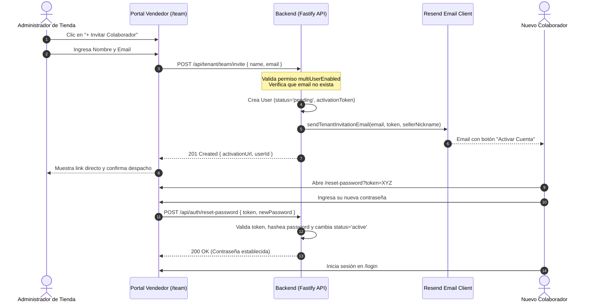

# 👥 Módulo Multi-Usuario y Gestión de Equipos de Venta

Documentación técnica y funcional sobre la arquitectura **Multi-Usuario / Gestión de Equipos** de **MELI AI Assistant**, permitiendo que múltiples vendedores y colaboradores operen simultáneamente sobre una misma cuenta de Mercado Libre con permisos controlados desde el Super Administrador.

---

## 📑 Tabla de Contenidos

1. [Visión General & Modelo Conceptual](#1-visión-general--modelo-conceptual)
2. [Control Granular de Permisos (Super Admin)](#2-control-granular-de-permisos-super-admin)
3. [Arquitectura & Flujo de Invitación y Activación](#3-arquitectura--flujo-de-invitación-y-activación)
4. [Entidades y Modelo de Datos](#4-entidades-y-modelo-de-datos)
5. [Casos de Uso del Backend](#5-casos-de-uso-del-backend)
6. [Referencia de Endpoints API](#6-referencia-de-endpoints-api)
7. [Modelo de Alertas y Concurrencia de Vendedores](#7-modelo-de-alertas-y-concurrencia-de-vendedores)
8. [Interfaz de Usuario (Portal del Vendedor)](#8-interfaz-de-usuario-portal-del-vendedor)
9. [Pruebas Automatizadas y Validación](#9-pruebas-automatizadas-y-validación)

---

## 1. Visión General & Modelo Conceptual

En Mercado Libre, una tienda oficial o empresa vendedora suele tener **una sola cuenta de MELI** (`sellerId`), pero su operación diaria es atendida por un **equipo de varios vendedores y colaboradores**.

El módulo Multi-Usuario resuelve esta necesidad permitiendo:
- **Múltiples accesos independientes**: Cada vendedor accede con su propio email y contraseña al panel `/team` de su tienda.
- **Asociación unificada por `sellerId`**: Todos los colaboradores de la tienda operan sobre el mismo inventario, publicaciones, preguntas y reclamos.
- **Control granular por plan**: El Super Administrador puede habilitar o inhabilitar la funcionalidad `multiUserEnabled` por cada tienda según su plan comercial.

```
       ┌────────────────────────────────────────────────────────┐
       │             Cuenta Mercado Libre (sellerId)            │
       └───────────────────────────┬────────────────────────────┘
                                   │
       ┌───────────────────────────┼────────────────────────────┐
       ▼                           ▼                            ▼
┌──────────────┐            ┌──────────────┐             ┌──────────────┐
│  Vendedor 1  │            │  Vendedor 2  │             │ Administrador│
│ (Laura G.)   │            │ (Carlos M.)  │             │ (Titular)    │
└──────────────┘            └──────────────┘             └──────────────┘
```

---

## 2. Control Granular de Permisos (Super Admin)

El acceso a este módulo está condicionado por el permiso **`multiUserEnabled`** dentro de las políticas de `TenantPermissions`.

* **Por Defecto (`false`)**: La tienda opera en modalidad *Mono-Usuario*. Al navegar a `/team`, el vendedor visualiza un banner explicativo indicando que la función está bloqueada en su plan.
* **Habilitado (`true`)**: Se desbloquea la vista completa de `/team`, permitiendo invitar nuevos miembros, consultar métricas y revocar accesos.

### Configuración en Super Admin (`/admin`)
En la vista de detalle de cada tenant en el panel de administración, se encuentra el switch:
- **`Equipo / Multi-Usuario`**: Al activarlo y guardar cambios, se emite una petición `PATCH /api/admin/tenants/:sellerId/permissions` que actualiza el registro en la base de datos.

---

## 3. Arquitectura & Flujo de Invitación y Activación



---

## 4. Entidades y Modelo de Datos

### 4.1 Modificaciones en `Tenant` (`src/domain/entities/Tenant.ts`)
```typescript
export interface TenantPermissions {
  autoAnswerEnabled?: boolean
  claimsAutoResponse?: boolean
  questionsAutoResponse?: boolean
  telegramNotifications?: boolean
  emailAlerts?: boolean
  whatsappNotifications?: boolean
  multiUserEnabled?: boolean // 👈 Control granular de equipo
}
```

### 4.2 Campos Relevantes en `User` (`src/domain/entities/User.ts`)
```typescript
export interface User {
  id: string
  email: string
  name: string
  role: 'super_admin' | 'tenant' | 'demo'
  sellerId?: string | null     // Vincula al colaborador con la tienda
  status: 'active' | 'pending' // Estado de activación
  activationToken?: string | null
  activationTokenExpiresAt?: Date | null
  createdAt: Date
  updatedAt: Date
}
```

### 4.3 Métodos en `IUserRepository` / `SqliteUserRepository`
- `findAllBySellerId(sellerId: string): Promise<User[]>`: Retorna todos los usuarios asociados a una tienda.
- `delete(id: string): Promise<void>`: Elimina un usuario de la base de datos.

---

## 5. Casos de Uso del Backend

### 5.1 `ListTeamMembersUseCase`
- **Ubicación:** `src/application/use-cases/tenant/ListTeamMembersUseCase.ts`
- **Entrada:** `{ sellerId: string }`
- **Lógica:**
  1. Obtiene el tenant para verificar `tenant.effectivePermissions.multiUserEnabled`.
  2. Si está habilitado, recupera todos los usuarios con `findAllBySellerId(sellerId)`.
  3. Sanitiza la información (excluyendo contraseñas) y retorna la lista ordenada por fecha de creación.

### 5.2 `InviteTeamMemberUseCase`
- **Ubicación:** `src/application/use-cases/tenant/InviteTeamMemberUseCase.ts`
- **Entrada:** `{ sellerId: string, email: string, name: string, actorUserId: string }`
- **Lógica:**
  1. Verifica `multiUserEnabled === true`. Si no, arroja `403 Forbidden`.
  2. Verifica que el correo no esté registrado.
  3. Genera un `activationToken` seguro (32 bytes hex) con expiración de 7 días.
  4. Inserta el usuario en la base de datos con `status: 'pending'`.
  5. Despacha el correo de invitación usando `ResendEmailClient.sendTenantInvitationEmail`.
  6. Registra el evento en el log de auditoría del tenant.

### 5.3 `RemoveTeamMemberUseCase`
- **Ubicación:** `src/application/use-cases/tenant/RemoveTeamMemberUseCase.ts`
- **Entrada:** `{ sellerId: string, memberId: string, actorUserId: string }`
- **Lógica:**
  1. Impide que un usuario se auto-elimine (`memberId !== actorUserId`).
  2. Valida que el colaborador pertenezca al `sellerId` del tenant solicitante.
  3. Ejecuta `userRepository.delete(memberId)`.
  4. Registra auditoría de desvinculación.

---

## 6. Referencia de Endpoints API

### GET `/api/tenant/team`
Obtiene los miembros del equipo y el estado del permiso.
- **Autenticación:** JWT con rol `tenant`
- **Respuesta 200:**
```json
{
  "multiUserEnabled": true,
  "members": [
    {
      "id": "u-admin-1",
      "name": "Titular de la Tienda",
      "email": "titular@empresa.com",
      "role": "tenant",
      "status": "active",
      "createdAt": "2026-09-01T12:00:00.000Z",
      "activationToken": null
    },
    {
      "id": "u-seller-2",
      "name": "Martín Palermo",
      "email": "vendedor@empresa.com",
      "role": "tenant",
      "status": "pending",
      "createdAt": "2026-09-14T10:45:00.000Z",
      "activationToken": "a8f3b2c9e4..."
    }
  ]
}
```

### POST `/api/tenant/team/invite`
Invita a un nuevo colaborador.
- **Autenticación:** JWT con rol `tenant`
- **Body:**
```json
{
  "name": "Martín Palermo",
  "email": "vendedor@empresa.com"
}
```
- **Respuesta 201:**
```json
{
  "userId": "u-seller-2",
  "name": "Martín Palermo",
  "email": "vendedor@empresa.com",
  "activationUrl": "http://localhost:5173/reset-password?token=a8f3b2c9e4..."
}
```

### DELETE `/api/tenant/team/:memberId`
Elimina un colaborador del equipo.
- **Autenticación:** JWT con rol `tenant`
- **Respuesta 200:**
```json
{
  "ok": true,
  "message": "Colaborador eliminado correctamente."
}
```

---

## 7. Modelo de Alertas y Concurrencia de Vendedores

Para evitar respuestas duplicadas y colisiones operativas cuando múltiples vendedores atienden en tiempo real:

1. **Notificaciones Simultáneas (Broadcast Compartido)**:
   - Los eventos de nuevas preguntas y reclamos se envían por SSE a todas las pestañas activas del portal.
   - En canales externos (Email / Resend o Telegram), la notificación llega al pool del equipo.

2. **Bloqueo por Primer Respondedor (First Responder Lock)**:
   - Cuando un vendedor hace clic en *"Aprobar"* o *"Enviar Respuesta"*, la API valida el estado de la pregunta.
   - Si otro colaborador ya publicó la respuesta, el sistema rechaza la acción secundaria con un aviso: `"Esta pregunta ya fue respondida por otro miembro del equipo"`.

---

## 8. Interfaz de Usuario (Portal del Vendedor)

### 8.1 Sección en Navegación (`Sidebar.tsx`)
- Nueva ruta `/team` bajo el ítem **"Equipo & Vendedores"** con ícono `<Users size={18} />`.

### 8.2 Componentes Visuales (`TenantPage.tsx` + `TenantPage.css`)
- **Tarjeta de Estado Bloqueado**: Presenta un diseño glassmorphic con gradientes ámbar y checklist de beneficios de pasarse a Multi-Usuario.
- **Panel de Gestión Activo**:
  - **Métricas:** 3 tarjetas resumen (*Usuarios Totales*, *Activos*, *Pendientes*).
  - **Tabla de Colaboradores:** Avatares con iniciales, rol, badges de estado dinámicos (`Activo` en verde, `Pendiente` en amarillo), fecha de alta y menú de acciones.
  - **Acciones Rápidas:** Botón *Copiar Enlace* para miembros pendientes y botón *Eliminar* con confirmación modal.
  - **Modal de Invitación:** Formulario de alta rápida con feedback instantáneo y enlace directo copiable para WhatsApp o Telegram.

---

## 9. Pruebas Automatizadas y Validación

### Tests Unitarios (`src/tests/TeamManagement.test.ts`)
Incluye 6 pruebas unitarias que cubren:
- Listado de colaboradores con flag de permiso.
- Invitación exitosa y generación de token.
- Rechazo de invitación cuando el permiso `multiUserEnabled` es falso (`403 Forbidden`).
- Rechazo de invitación ante correos duplicados (`409 Conflict`).
- Eliminación exitosa de colaboradores.
- Prevención de auto-eliminación (`400 Bad Request`).

### Ejecución de Pruebas
```bash
# Ejecutar suite de pruebas completa
npm test

# Ejecutar únicamente tests de gestión de equipo
npx vitest run src/tests/TeamManagement.test.ts
```
