# 🤖 Guía de Asistente Inteligente & Tools en Telegram

Documentación técnica y operativa del **Asistente Conversacional con Tools (Function Calling)** de **MELI AI Assistant** para el bot de Telegram.

---

## 📑 Tabla de Contenidos

1. [Visión General](#1-visión-general)
2. [Arquitectura del Asistente](#2-arquitectura-del-asistente)
3. [Catálogo de Herramientas (Tools)](#3-catálogo-de-herramientas-tools)
   - [3.1 `get_pending_questions`](#31-get_pending_questions)
   - [3.2 `get_claims`](#32-get_claims)
   - [3.3 `get_claim_detail`](#33-get_claim_detail)
   - [3.4 `get_recent_alerts`](#34-get_recent_alerts)
   - [3.5 `get_store_metrics`](#35-get_store_metrics)
4. [Mecanismo de Botones Inline & Callback Queries](#4-mecanismo-de-botones-inline--callback-queries)
5. [Motor Dual: LangChain Tool Calling + Fallback Determinístico](#5-motor-dual-langchain-tool-calling--fallback-determinístico)
6. [Cómo Vincular una Tienda al Chat de Telegram](#6-cómo-vincular-una-tienda-al-chat-de-telegram)
7. [Variables de Entorno](#7-variables-de-entorno)
8. [Pruebas Automatizadas y Verificación](#8-pruebas-automatizadas-y-verificación)

---

## 1. Visión General

El bot de Telegram evolucionó de un sistema unidireccional de alertas pasivas a un **Asistente Inteligente Interactivo y Bidireccional**. 

Los vendedores de Mercado Libre pueden realizar preguntas en **lenguaje natural argentino** desde su smartphone y el asistente:
1. Interpreta la intención del mensaje.
2. Invoca automáticamente las **herramientas (tools)** conectadas a la base de datos de la tienda.
3. Formatea la respuesta en **Markdown para Telegram con emojis claros**.
4. Adjunta **botones interactivos de 1-click** para aprobar respuestas, descartarlas o solicitar más detalles.

---

## 2. Arquitectura del Asistente

```mermaid
sequenceDiagram
    autonumber
    actor Vendedor as Vendedor (Telegram)
    participant Bot as TelegramBotClient
    participant Webhook as HandleTelegramWebhookUseCase
    participant Agent as TelegramAssistantService
    participant Tools as Repositorios (Question, Claim, Event)
    participant LLM as LangChain (Groq / OpenAI / Anthropic)

    Vendedor->>Bot: "¿Qué reclamos tengo abiertos y qué preguntas pendientes?"
    Bot->>Webhook: Webhook Update (chat_id, text)
    Webhook->>Webhook: Identificar Tenant vinculado al Chat ID
    Webhook->>Agent: processMessage(tenant, text, chatId)
    
    rect rgb(30, 41, 59)
    note right of Agent: Ciclo de Ejecución de Tools
    Agent->>LLM: Prompt con definiciones de Tools
    LLM-->>Agent: Invocación: get_claims(status='opened'), get_pending_questions()
    Agent->>Tools: Consultar QuestionRepo & ClaimRepo
    Tools-->>Agent: Datos estructurados (SLA, textos, sugerencias)
    Agent->>LLM: Retornar resultados de las tools
    LLM-->>Agent: Respuesta sintetizada en Markdown
    end

    Agent->>Bot: Enviar mensaje enriquecido + Botones interactivos
    Bot-->>Vendedor: Mensaje formateado con botones [✅ Aprobar] [🔍 Detalle]
```



---

## 3. Catálogo de Herramientas (Tools)

### 3.1 `get_pending_questions`

Obtiene las preguntas pre-venta del vendedor que están pendientes de respuesta o requieren revisión humana obligatoria (por baja confianza del LLM, moderación o políticas de tienda).

* **Parámetros:**
  ```typescript
  {
    limit?: number // Cantidad máxima de preguntas a devolver (por defecto: 5)
  }
  ```
* **Datos Retornados:**
  - `id`: Identificador de la pregunta en Mercado Libre.
  - `itemTitle`: Título de la publicación consultada.
  - `question`: Texto exacto redactado por el comprador.
  - `suggestedAnswer`: Respuesta sugerida generada por la IA.
  - `reason`: Motivo de derivación humana.
  - `receivedAt`: Fecha y hora de recepción.
* **Botones Generados:**
  - `[✅ Aprobar #ID]` (Callback: `approve_<id>`)
  - `[❌ Rechazar #ID]` (Callback: `reject_<id>`)
* **Ejemplos de Mensajes del Vendedor:**
  - *"¿Qué preguntas tengo pendientes?"*
  - *"¿Hay preguntas sin responder?"*
  - *"Mostrame las preguntas por revisar"*

---

### 3.2 `get_claims`

Lista los reclamos del vendedor con cálculo en tiempo real de la cuenta regresiva de **SLA (horas restantes antes de afectar reputación)**.

* **Parámetros:**
  ```typescript
  {
    status?: "opened" | "closed" | "all", // "opened" (en gestión), "closed" (resueltos), "all" (todos)
    urgentOnly?: boolean                  // true para filtrar solo SLA crítico (< 24hs)
  }
  ```
* **Datos Retornados:**
  - `id`: ID del reclamo.
  - `orderId`: Número de orden de compra asociada.
  - `type`: Tipo de reclamo (`med_pnr`: paquete no recibido, `med_pdd`: producto defectuoso, etc.).
  - `status`: Estado del reclamo (`opened` / `closed`).
  - `reason`: Motivo alegado por el comprador.
  - `remainingHours`: Horas restantes para responder.
  - `urgency`: Nivel de urgencia (`critical`, `high`, `medium`, `low`).
* **Botones Generados:**
  - `[🔍 Detalle Reclamo #ID]` (Callback: `claim_detail_<id>`)
* **Ejemplos de Mensajes del Vendedor:**
  - *"¿Tengo reclamos en gestión?"*
  - *"¿Qué reclamos están abiertos o urgentes?"*
  - *"¿Hay reclamos resueltos?"*

---

### 3.3 `get_claim_detail`

Obtiene la ficha técnica completa y pormenorizada de un reclamo particular a partir de su ID numérico o alfanumérico.

* **Parámetros:**
  ```typescript
  {
    claimId: string // ID del reclamo a consultar (ej: "5123456" o "C500")
  }
  ```
* **Datos Retornados:**
  - `id` y `orderId`: Identificadores únicos.
  - `buyerId`: Identificador del comprador en Mercado Libre.
  - `status` y `stage`: Estado y etapa procesal del reclamo.
  - `reason`: Explicación detallada del problema.
  - `actions`: Acciones habilitadas para el vendedor (`send_message_to_buyer`, `refund`, `allow_return`, etc.).
  - `dueDate`: Fecha y hora exacta de vencimiento.
  - `remainingHours` & `urgency`: Tiempo disponible y nivel de criticidad.
* **Botones Generados:**
  - `[✅ Confirmar Lectura #ID]` (Callback: `claim_ack_<id>`)
* **Ejemplos de Mensajes del Vendedor:**
  - *"Detallame el reclamo #51234"*
  - *"Ver reclamo C500"*
  - *"¿Por qué abrió el reclamo el comprador del reclamo 500?"*

---

### 3.4 `get_recent_alerts`

Permite al vendedor ponerse al día con los últimos eventos registrados por el sistema.

* **Parámetros:**
  ```typescript
  {
    limit?: number // Cantidad de eventos a listar (por defecto: 5)
  }
  ```
* **Datos Retornados:**
  - Tipo de evento (`pending_review`, `moderation_checked`, `telegram_alert_sent`, `claim_notified`, etc.).
  - Mensaje descriptivo con emojis.
  - Timestamp del evento.
* **Ejemplos de Mensajes del Vendedor:**
  - *"¿Qué alertas me perdí?"*
  - *"Mostrame las últimas notificaciones"*
  - *"¿Qué pasó hoy en la tienda?"*

---

### 3.5 `get_store_metrics`

Provee un resumen cuantitativo y de rendimiento de la automatización de la tienda.

* **Parámetros:** Ninguno.
* **Datos Retornados:**
  - `totalQuestions`: Preguntas pre-venta procesadas.
  - `autoAnswered`: Preguntas respondidas 100% por la IA.
  - `autoAnswerRate`: Porcentaje de automatización efectiva (ej: `87.5%`).
  - `pendingReviewCount`: Preguntas en cola humana.
  - `openClaimsCount`: Cantidad de reclamos abiertos.
* **Ejemplos de Mensajes del Vendedor:**
  - *"¿Cómo vienen las métricas de hoy?"*
  - *"Mostrame un resumen de la tienda"*
  - *"Estado general de la cuenta"*

---

## 4. Mecanismo de Botones Inline & Callback Queries

Los botones inline de Telegram permiten ejecutar acciones instantáneas sin salir del chat:

| Callback Data | Acción Ejecutada | Efecto en la Plataforma |
| :--- | :--- | :--- |
| `approve_<questionId>` | Publica la respuesta en Mercado Libre | Llama a `ApproveAnswerUseCase`, publica la respuesta en la API de MELI y actualiza el mensaje en Telegram a `✅ Aprobada`. |
| `reject_<questionId>` | Descarta la sugerencia de la IA | Llama a `RejectAnswerUseCase`, archiva la pregunta y actualiza el mensaje a `🗑️ Rechazada`. |
| `claim_detail_<claimId>` | Consulta los detalles del reclamo | Invoca `get_claim_detail` y envía la ficha técnica completa al chat. |
| `claim_ack_<claimId>` | Acusa recibo del reclamo | Registra el evento en `event_logs` y avisa al vendedor que debe responder antes del plazo. |

---

## 5. Motor Dual: LangChain Tool Calling + Fallback Determinístico

Para garantizar **disponibilidad del 100%**:

1. **Motor Primario (LangChain + Tool Calling)**:
   - Utiliza modelos con soporte de Structured Tools (`Groq` con Llama 3.3/GPT-OSS, `OpenAI` gpt-4o-mini o `Anthropic` Claude 3.5 Sonnet).
   - Interpreta preguntas complejas, múltiples intenciones y lenguaje coloquial.
2. **Motor Secundario (Fallback Determinístico por Expresiones Regulares)**:
   - Si no hay API Key de LLM configurada, hay problemas de red o cuota excedida en el proveedor de IA, el servicio conmuta automáticamente a un motor determinístico con regex.
   - Reconoce patrones clave (`reclamo C500`, `preguntas pendientes`, `métricas`, `alertas`) y consulta directamente los repositorios sin degradación del servicio.

---

## 6. Cómo Vincular una Tienda al Chat de Telegram

1. Abrí el chat con tu bot en Telegram (ej: `@TuBotDeMeliBot`).
2. Obtené tu **Seller ID** de Mercado Libre (ej: `3680586616`).
3. Enviá el comando:
   ```
   /start tenant_3680586616
   ```
4. El bot responderá:
   ```
   🎉 ¡Conexión Exitosa con MELI AI Assistant!
   Tu cuenta de Mercado Libre (TiendaTest) quedó vinculada a este chat.
   ```

---

## 7. Variables de Entorno

En tu archivo `.env`:

```ini
# Token del Bot de Telegram (obtenido de @BotFather)
TELEGRAM_BOT_TOKEN=123456789:ABCdefGhIJKlmNoPQRsTUVwxyZ

# Proveedor de Inteligencia Artificial para el Asistente
LLM_PROVIDER=groq
GROQ_API_KEY=gsk_tu_api_key_aqui
LLM_MODEL=openai/gpt-oss-120b
```

---

## 8. Pruebas Automatizadas y Verificación

El asistente cuenta con una suite completa de pruebas unitarias en **Vitest**:

```powershell
# Ejecutar todas las pruebas del Asistente y Webhook de Telegram
npx vitest run src/tests/TelegramAssistantService.test.ts src/tests/HandleTelegramWebhookUseCase.test.ts
```

### Casos de Prueba Validados:
* ✅ Extracción de preguntas en `pending_review` y serialización de fechas.
* ✅ Cálculo de SLA y asignación de nivel de criticidad en reclamos.
* ✅ Búsqueda insensible a mayúsculas/minúsculas de reclamos por ID.
* ✅ Generación de botones interactivos para aprobación y detalle.
* ✅ Ejecución resiliente en modo Fallback Determinístico sin API Key.
* ✅ Ejecución completa de callbacks `claim_detail_<id>`, `approve_<id>` y `reject_<id>`.
